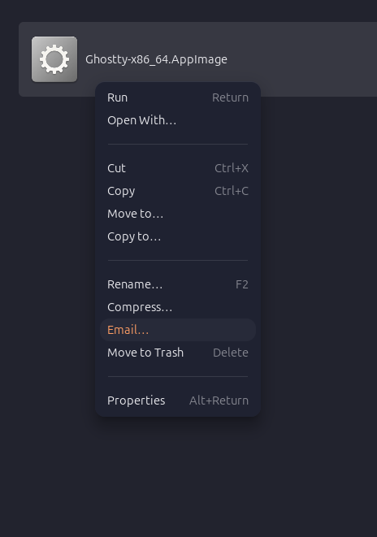
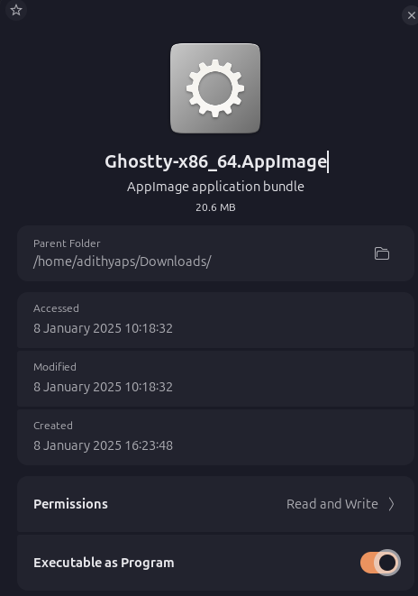

<h1><p align="center">
  
  
  <br>Ghostty AppImage<br>
  
  
  
  
  
  
</p></h1>

This repository provides build scripts to create a Universal AppImage for [Ghostty](https://ghostty.org/). This unofficial build offers an executable AppImage compatible with any Linux distribution (Including musl based).

**Ghostty Source Code:** [Click Here](https://github.com/ghostty-org/ghostty)

## 🚀 Quick Start

1. Download the latest AppImage from the [releases](https://github.com/psadi/ghostty-appimage/releases) section.
2. Follow the installation instructions below to run the AppImage.

## 📦 Builds

1. Ghostty AppImages are available for both **x86_64** and **aarch64** systems.
1. Stable builds are based on upstream releases, with minor fixes and patches released as **version+1** tag(s).
1. Daily nightly builds, based on the upstream [tip releases](https://github.com/ghostty-org/ghostty/releases/tag/tip), are built and released at **00:00 UTC every day** and are available as pre-releases in the [releases](https://github.com/psadi/ghostty-appimage/releases/tag/tip) section.

## ⚙️ Installation

<details>
  <summary><b>Command Line (Manual)</b></summary>

Run the following commands in your terminal:

```bash
# Download the latest AppImage package from releases
wget https://github.com/psadi/ghostty-appimage/releases/download/${VERSION}/Ghostty-${VERSION}-${ARCH}.AppImage

# Make the AppImage executable
chmod +x Ghostty-${VERSION}-${ARCH}.AppImage

# Run the AppImage
./Ghostty-${VERSION}-${ARCH}.AppImage

# Optionally, add the AppImage to your PATH for easier access

# With sudo for system wide availability
sudo install ./Ghostty-${VERSION}-${ARCH}.AppImage /usr/local/bin/ghostty

# Without sudo, XDG base spec mandate
install ./Ghostty-${VERSION}-${ARCH}.AppImage $HOME/.local/bin/ghostty

# Now you can run Ghostty from anywhere using the command:
ghostty
```

</details>

<details>
  <summary><b>Command Line (Automatic)</b></summary>

Ghostty AppImage can be accessed through [**Soar**](https://github.com/pkgforge/soar) or [**AM**](https://github.com/ivan-hc/AM)/[**AppMan**](https://github.com/ivan-hc/AppMan). These tools automate the installation process, configure the PATH, and integrate with your desktop environment when installing AppImages.

1. Using [**Soar**](https://github.com/pkgforge/soar)

   ```bash
   # Install
   soar install ghostty

   # Upgrade
   soar update ghostty

   # Uninstall
   soar remove ghostty
   ```

1. Using [**AM**](https://github.com/ivan-hc/AM) or [**AppMan**](https://github.com/ivan-hc/AppMan) _(Choose one as appropriate)_

   ```bash
   # Install
   am -i ghostty

   # Upgrade
   am -u ghostty

   # Uninstall
   am -r ghostty
   ```

_Note: Ensure you have the necessary permissions to run these commands. For more detailed usage, refer to the documentation of each tool._

</details>

<details>
  <summary><b>Graphical (Manual)</b></summary>

1. Download the latest AppImage package from the [releases](https://github.com/psadi/ghostty-appimage/releases) section.
2. Locate the downloaded file in your file explorer (e.g., Nautilus, Thunar, PCManFM).
3. Right-click the downloaded file and select **Properties**.
4. Navigate to the **Permissions** tab and check the box that says **Allow executing file as program/Executable as Program**.
5. Close the properties window and double-click the AppImage file to run it.

<p align="center">
  
  
</p>

</details>

<details>
  <summary><b>Graphical (Automatic)</b></summary>

Ghostty AppImage can easily be managed using graphical tools such as [AppImageLauncher](https://github.com/TheAssassin/AppImageLauncher) and [Gear Lever](https://github.com/mijorus/gearlever).

1. **Using [AppImageLauncher](https://github.com/TheAssassin/AppImageLauncher)**

   For detailed instructions, please refer to the [AppImageLauncher documentation](https://docs.appimage.org/user-guide/run-appimages.html#appimagelauncher).

   > **🛈 NOTE**
   >
   > With the launch of AppImageLauncher **v3.0.0**, you have to use the alpha pre-releases as the stable release doesn't work with the static runtime
   >
   > For more information please refer the [discussion](https://github.com/TheAssassin/AppImageLauncher/discussions/687) and the [comment](https://github.com/TheAssassin/AppImageLauncher/discussions/687#discussioncomment-12181060)

2. **Using [Gear Lever](https://github.com/mijorus/gearlever)**

   - Download the latest AppImage package from the [releases](https://github.com/psadi/ghostty-appimage/releases) section.
   - Simply drag and drop the files from your file manager into the Gear Lever application.
   - Follow the on-screen instructions to configure the setup as a one-time installation process.

_Note: Ensure the necessary prerequsites are satisfied for these applications. For more detailed usage, refer to the documentation of each tool_

   </details>

## ⏫ Updating

Since AppImages are self-contained executables, there is no formal installation process beyond setting executable permissions.

<details>
  <summary><b>Update (Manual)</b></summary>

1. Download the latest AppImage package from the [releases](https://github.com/psadi/ghostty-appimage/releases) section.
1. Follow the same steps as in the [Installation](#installation) section to make it executable and run it.

</details>

<details>
  <summary><b>Update (Automatic)</b></summary>

1. Use [AppImageUpdate](https://github.com/AppImageCommunity/AppImageUpdate) which reads the update information in the AppImage. This is a low level tool.
1. Use a higher level tool that uses AppImageUpdate, like [AppImageLauncher](https://github.com/TheAssassin/AppImageLauncher), [AM](https://github.com/ivan-hc/AM) or [appimaged](https://github.com/probonopd/go-appimage/blob/master/src/appimaged/README.md) daemon, these tools also automatically handle desktop integration.

</details>

## 🛠️ Troubleshooting

Refer [TROUBLESHOOTING.md](./TROUBLESHOOTING.md) file

## 🤝 Contributing

Contributions & Bugfixes are welcome. If you like to contribute, please feel free to fork the repository and submit a pull request.

For any questions or discussions, please open an issue in the repository.
